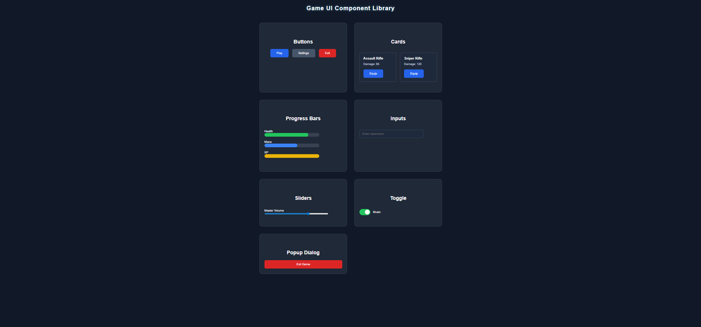
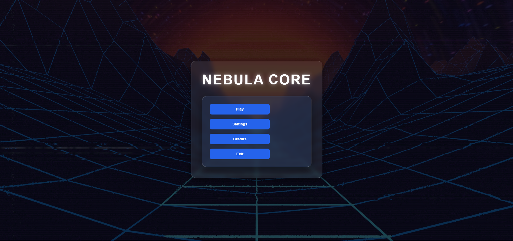
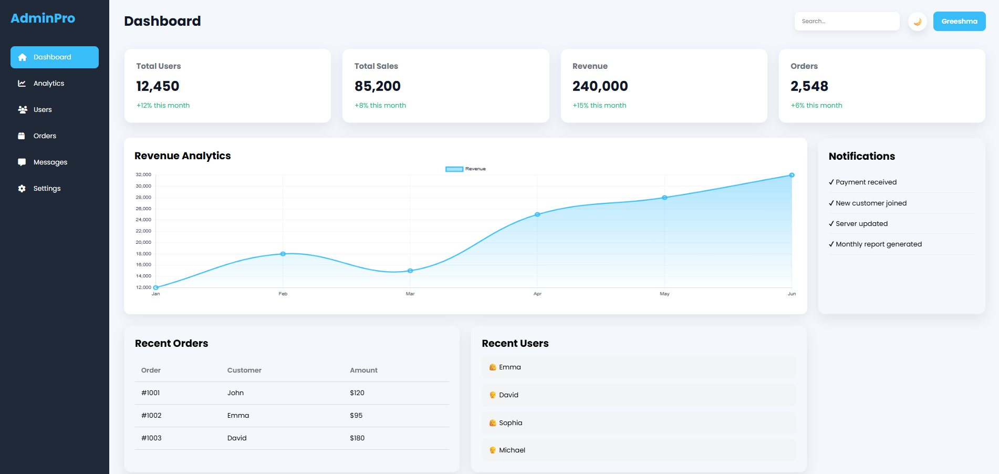
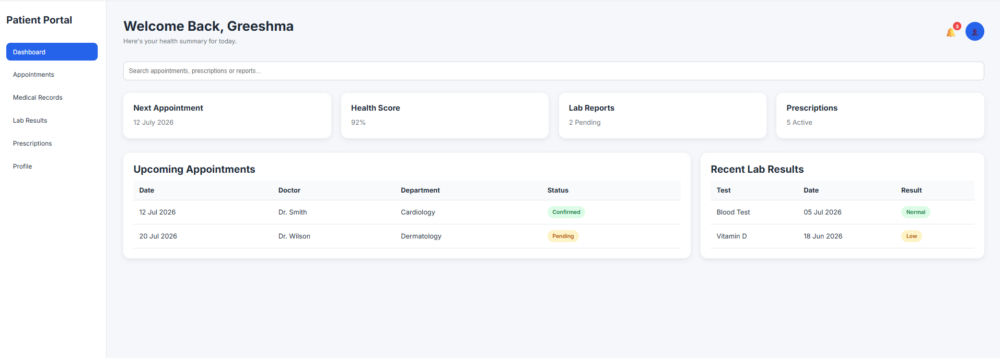

# 🎨 UI Projects Portfolio

A collection of responsive UI projects built with HTML, CSS, and JavaScript.

## 🎮 Game UI Library

🌐 Live Demo:
https://greeshmabal92-a11y.github.io/game-ui-library/

📂 Repository:
https://github.com/greeshmabal92-a11y/game-ui-library

---

## 🎮 Game Main Menu

🌐 Live Demo:
https://greeshmabal92-a11y.github.io/game-main-menu/

📂 Repository:
https://github.com/greeshmabal92-a11y/game-main-menu

---

## 🎮 Game HUD

🌐 Live Demo:
https://greeshmabal92-a11y.github.io/game-hud/

📂 Repository:
https://github.com/greeshmabal92-a11y/game-hud

---

## 📊 Admin Dashboard

🌐 Live Demo:
https://greeshmabal92-a11y.github.io/admin-dashboard/

📂 Repository:
https://github.com/greeshmabal92-a11y/admin-dashboard

🏥 Healthcare Patient Portal

🌐 Live Demo:

https://greeshmabal92-a11y.github.io/patient-portal/

📁 Repository:

https://github.com/greeshmabal92-a11y/patient-portal

